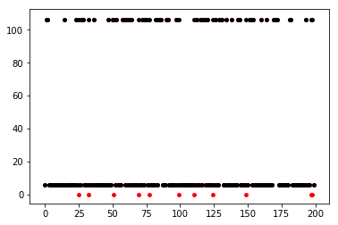

# Sduw_Java_ML_2022

### 1. 安装依赖

由于可视化使用了 Python 的原因，您需要预先安装 `pandas` 和 `matplotlib` 两个库，安装方法为在命令提示符（cmd）或 Windows 终端中键入：

```
pip install matplotlib
pip install pandas
```

### 2.运行

运行 `src/knn/one/KNNTest.java`，会要求通过标准输入流输入 KNN 中的超参数 `k`，之后标准输出流会输出每组数据，以及它们的真实标签与预测标签和最终的分类正确率，并将可视化数据输出至 `./Predicted_Ans.csv` 和 `./Real_Ans.csv` 中。

运行 `src/visual.py`，会生成一张可视化的图片。



其中红色点表示真实数据，黑色点表示预测数据。